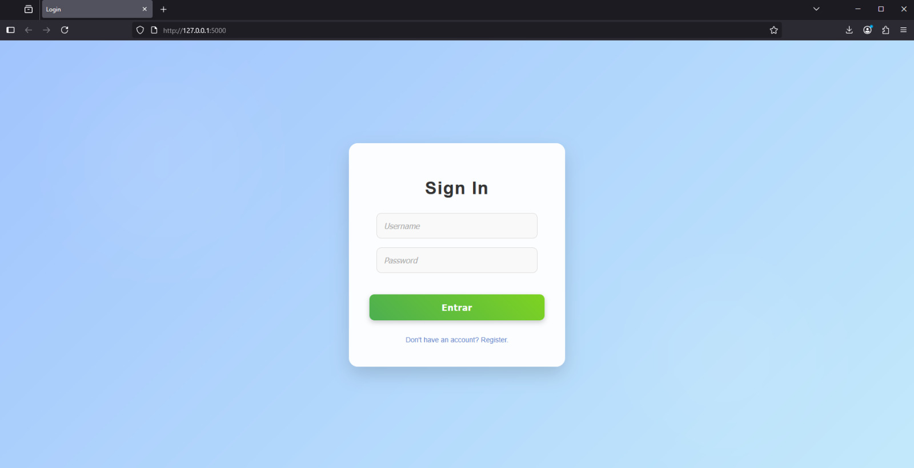

# Flask User Authentication System (SSR)




This project is a simple example of a user login system built with Flask, using **server-side rendering (SSR)** for simplicity and SEO benefits. It demonstrates robust user authentication with **secure password hashing (Argon2)**, **session management**, and **CSRF protection**.

---

## Features

* **User registration and login**: Complete flow for user authentication.
* **Password hashing with Argon2**: Secure storage of user passwords.
* **Session management with secure cookies**: Securely maintains user sessions.
* **Rate limiting**: Protection against brute-force attacks.
* **CSRF protection**: Security against Cross-Site Request Forgery attacks.
* **Modular structure with Flask Blueprints**: Facilitates code reuse and scalability.

---

## Tech Stack

* **Python 3**
* **Flask**: Microframework.
* **Flask-WTF**: Form handling and CSRF protection.
* **Flask-Limiter**: Rate limiting implementation.
* **Flask-Talisman**: HTTP security headers configuration.
* **SQLAlchemy**: ORM for database interaction.
* **Argon2**: Secure algorithm for password hashing.
* **SQLite**: Default database.

## 📂 Structure

```
├── app.py
├── config.py
├── extensions.py
├── routes/
│ ├── auth.py
│ └── home.py
├── templates/
│ ├── login.html
│ ├── register.html
│ └── home.html
└── requirements.txt
```

---

## How to Run

Follow these steps to get the application up and running:

1.  **Clone this repository**:
    ```bash
    git clone https://github.com/NehuenLian/Flask-SSR-Login
    ```

2.  **Create and activate a virtual environment**:
    ```bash
    python -m venv venv
    # On Linux/macOS:
    source venv/bin/activate
    # On Windows:
    venv\Scripts\activate
    ```

3.  **Install dependencies**:
    ```bash
    pip install -r requirements.txt
    ```

4.  **Set the Flask secret key**:
    This key is crucial for session security and CSRF protection.
    * **Linux/macOS**:
        ```bash
        export SECRET_KEY='your_secret_key'
        ```
    * **Windows (CMD)**:
        ```bash
        set SECRET_KEY=your_secret_key
        ```

5.  **Run the application**:
    ```bash
    python app.py
    ```
    The application should be available at `http://127.0.0.1:5000/`.

---

## Additional Notes

* **Databases**: This project is designed to be easily adaptable to other databases. You only need to change the **SQLAlchemy URI** in the configuration.
* **Template Rendering**: Templates use **server-side rendering (SSR)**, which simplifies development and offers SEO benefits.
* **Flexibility**: Feel free to modularize, extend, or adapt this project for your own needs.